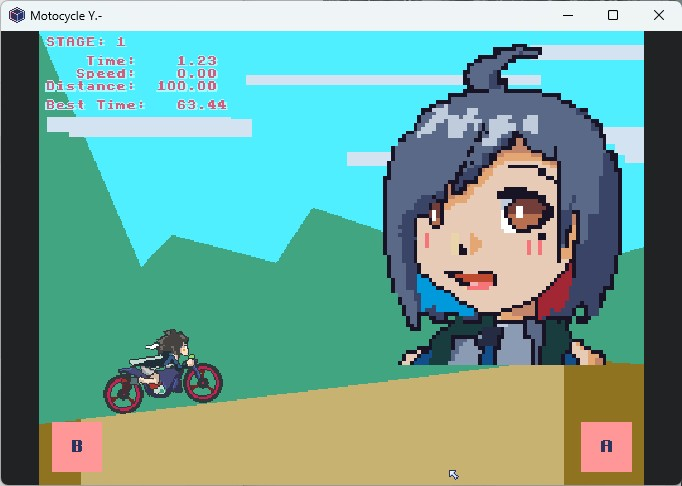


# Motorcycle

A tiny game made with Pyxel.

## Library

- [Pyxel](https://github.com/kitao/pyxel/blob/main/README.md)
- [Pillow](https://pypi.org/project/pillow/)

## Used Tools

- Pixquare for pixel art
- Aseprite for pixel art
- Lovely Composer for music
- ibisPaint for idea sketch

## Font

[VictoriaBold](https://opengameart.org/content/a-package-of-8-bit-fonts-for-grafx2-and-linux)

[Spleen](https://github.com/fcambus/spleen)

[Logisoso](https://fontlibrary.org/de/font/logisoso)
